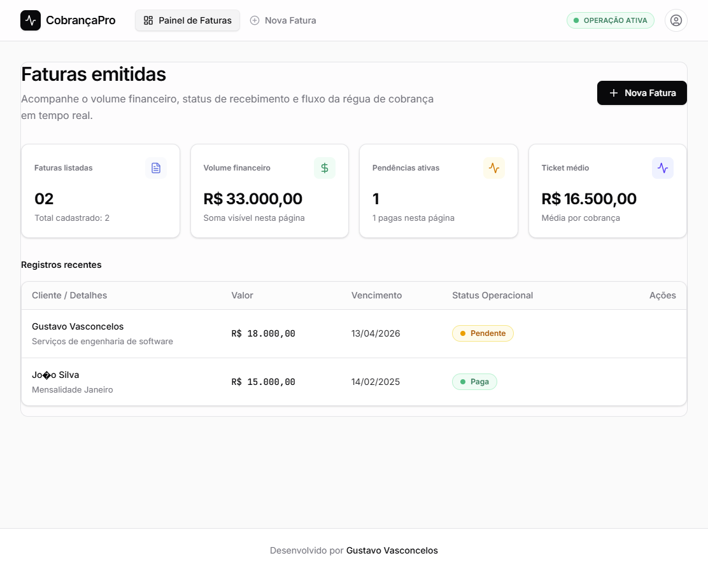
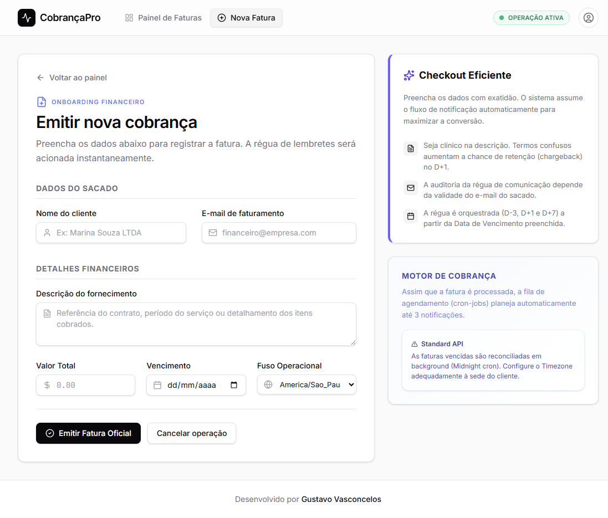
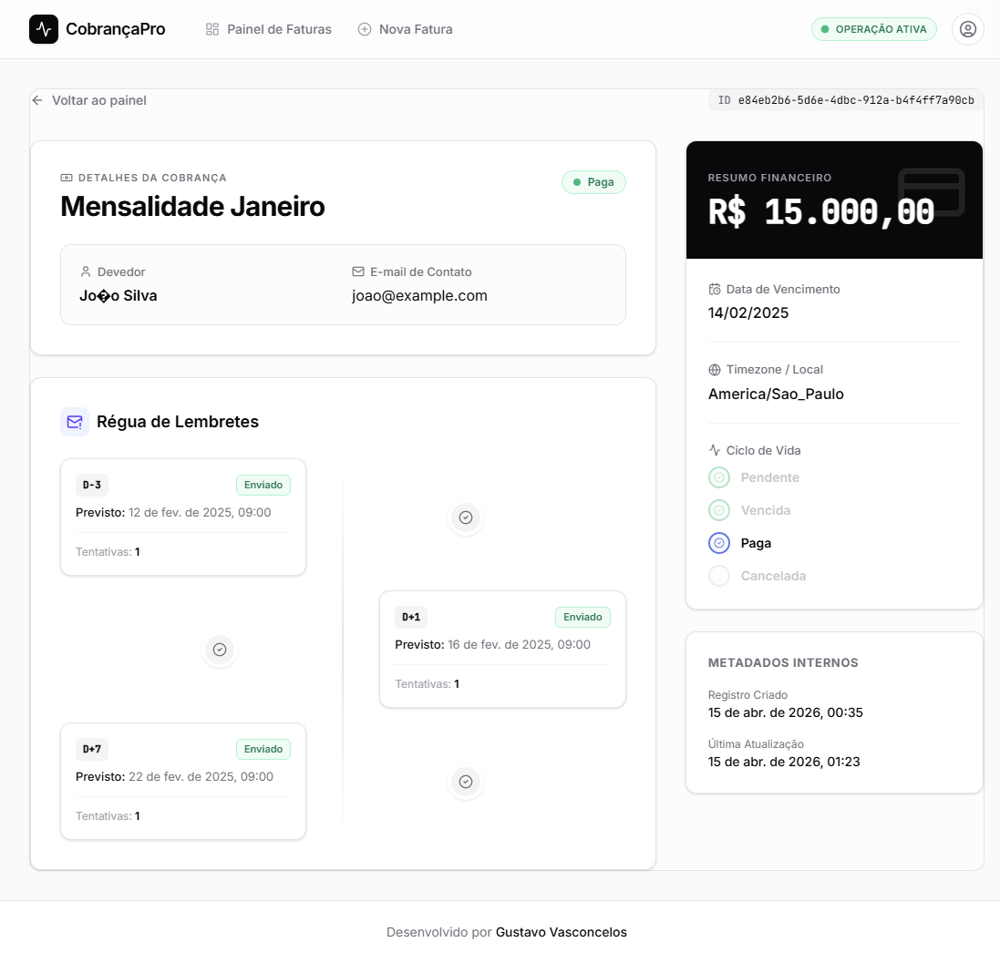

# Avaliação Técnica — Desenvolvedor Fullstack (UDS / Talent Studio)

Repositório com a solução da avaliação técnica. A entrega foi reelevada
para padrão **sênior especialista**: arquitetura hexagonal, outbox pattern,
idempotência HTTP, advisory locks, observabilidade (OTel + Prometheus +
pino), migrations versionadas, API RFC 7807 + keyset pagination, testes
property-based, DevEx completo (Dockerfile non-root, CI, Husky,
ESLint strict-type-checked).

## Estrutura

```
├── exercicio-1/   Backend NestJS — Régua de Cobranças (overhaul hexagonal)
├── exercicio-2/   Code Review: tenant leak + keyset + observabilidade
├── exercicio-3/   ADR 001 — Integração multi-gateway de pagamentos
├── frontend/      Interface web React + TypeScript + Vite (CobrançaPro)
├── docker-compose.yml   Postgres + Jaeger + app
├── .github/workflows/   CI (lint · typecheck · test · build)
└── AI_USAGE.md          Disclosure de uso de IA
```

## Pré-requisitos

- Node.js 20+
- Docker + Docker Compose
- npm

## Quickstart (opção 1 — tudo em container)

```bash
docker-compose up -d --build
# app:    http://localhost:3000
# docs:   http://localhost:3000/docs
# health: http://localhost:3000/health/readiness
# jaeger: http://localhost:16686
```

## Quickstart (opção 2 — app local, PG em container)

```bash
docker-compose up -d postgres
cd exercicio-1
cp .env.example .env
npm ci
npm run migration:run
npm run start:dev
```

## Endpoints principais (Ex1)

Versionados via URI prefix. Autenticados via `X-API-Key` (stub) + `X-User-Id`
(demo — em prod viria do JWT).

```bash
# Criar fatura (com Idempotency-Key)
curl -X POST http://localhost:3000/v1/faturas \
  -H "Content-Type: application/json" \
  -H "X-User-Id: 550e8400-e29b-41d4-a716-446655440000" \
  -H "Idempotency-Key: $(uuidgen)" \
  -d '{
    "nomeDevedor": "João Silva",
    "emailDevedor": "joao@empresa.com",
    "descricao": "Consultoria mensal",
    "valor": 3500.00,
    "dataVencimento": "2026-06-15",
    "timezone": "America/Sao_Paulo"
  }'

# Listar (paginated)
curl "http://localhost:3000/v1/faturas?page=1&pageSize=20" \
  -H "X-User-Id: 550e8400-e29b-41d4-a716-446655440000"

# Buscar por id (com ETag)
curl http://localhost:3000/v1/faturas/<id> \
  -H "X-User-Id: ..." -H "If-None-Match: W/\"abc\""

# PATCH status (state machine validada no domínio)
curl -X PATCH http://localhost:3000/v1/faturas/<id>/status \
  -H "Content-Type: application/json" \
  -H "X-User-Id: ..." \
  -d '{"status":"paga"}'
```

Swagger UI interativo: **http://localhost:3000/docs**.

## Observabilidade

| Endpoint | Uso |
|----------|-----|
| `GET /health/liveness` | Liveness probe (K8s) |
| `GET /health/readiness` | Readiness (PG ping + outbox depth) |
| `GET /metrics` | Prometheus scrape |
| `GET /docs` | Swagger UI / OpenAPI 3 |
| Jaeger UI | http://localhost:16686 |

## Testes

```bash
cd exercicio-1
npm test              # unit (domain + application + property-based)
npm run test:cov      # com coverage (threshold 85%)
npm run test:e2e      # requires Postgres rodando
npm run lint
npm run typecheck
```

## Variáveis de ambiente

Validadas via Zod no boot (fail-fast). Veja `exercicio-1/.env.example` — as
principais:

| Variável | Default | Propósito |
|----------|---------|-----------|
| `DB_HOST/PORT/USERNAME/PASSWORD/DATABASE` | localhost/5432/cobranca_* | Conexão PG |
| `DB_POOL_MAX` | 20 | Pool size (ver Ex2 RESPOSTAS §3.4) |
| `API_KEY_SHA256` | — | Hex sha256 da API key; ausente = modo dev permissivo |
| `DEFAULT_TIMEZONE` | America/Sao_Paulo | TZ IANA p/ cálculo da régua |
| `REMINDER_HOUR` | 9 | Hora local do envio |
| `SCHEDULER_MAX_ATTEMPTS` | 5 | Retry antes de mover p/ DLQ (FALHOU) |
| `THROTTLE_TTL_SECONDS`, `THROTTLE_LIMIT` | 60, 120 | Rate limit |
| `OTEL_ENABLED`, `OTEL_EXPORTER_OTLP_ENDPOINT` | false, — | Tracing |
| `CORS_ORIGINS` | `*` | CSV allowlist |


---

## Frontend — CobrançaPro

Interface web do sistema **CobrançaPro**, construída com **React 19**, **TypeScript**, **Vite** e **TailwindCSS v4**. Permite o gerenciamento completo de faturas de cobrança com régua de lembretes automatizada.

### Como executar o frontend

```bash
cd frontend
npm install
npm run dev
# Acesse http://localhost:5173
```

> O frontend depende do backend NestJS rodando na porta 3000. O Vite proxy redireciona `/v1` para `http://localhost:3000`.

### Telas da Aplicação

#### 1. Painel de Faturas (Dashboard)

**Rota:** `/` — Dashboard operacional com cards de métricas (volume financeiro, pendências, ticket médio), tabela paginada de faturas e ações rápidas. Responsivo: em mobile a tabela se transforma em cards empilhados.



#### 2. Emitir Nova Cobrança

**Rota:** `/faturas/new` — Formulário de criação com layout em duas colunas: dados do sacado e detalhes financeiros à esquerda, painel de dicas e explicação da régua de lembretes (D-3, D+1, D+7) à direita.



#### 3. Detalhes da Fatura

**Rota:** `/faturas/:id` — Visualização completa com dados da cobrança, timeline visual da régua de lembretes (status de envio e tentativas), resumo financeiro, ciclo de vida do status e botões de ação condicionais (confirmar pagamento / cancelar).



### Stack do Frontend

| Tecnologia | Finalidade |
|---|---|
| React 19 | Biblioteca de UI |
| TypeScript | Tipagem estática |
| Vite | Build tool e dev server |
| TailwindCSS v4 | Estilização utilitária |
| React Router DOM | Roteamento SPA |
| Axios | Cliente HTTP |
| Lucide React | Biblioteca de ícones |

> Documentação completa das telas com detalhes de cada elemento: [`frontend/README.md`](frontend/README.md)

---

## Autor

Projeto desenvolvido por **[Gustavo Vasconcelos — Desenvolvedor Fullstack Sênior](https://www.linkedin.com/in/gustavo-vasconcelos-software-engineer/)**.

Especialista em [Engenharia de Software Frontend](https://www.linkedin.com/in/gustavo-vasconcelos-software-engineer/) com foco em **React**, **TypeScript**, **Node.js** e **arquitetura de microsserviços**.

[](https://www.linkedin.com/in/gustavo-vasconcelos-software-engineer/)

**Palavras-chave:** [Desenvolvedor Frontend Sênior](https://www.linkedin.com/in/gustavo-vasconcelos-software-engineer/) · [Especialista React TypeScript](https://www.linkedin.com/in/gustavo-vasconcelos-software-engineer/) · [Engenheiro de Software Fullstack](https://www.linkedin.com/in/gustavo-vasconcelos-software-engineer/) · [Arquiteto Frontend](https://www.linkedin.com/in/gustavo-vasconcelos-software-engineer/) · [Senior Software Engineer](https://www.linkedin.com/in/gustavo-vasconcelos-software-engineer/) · [Node.js NestJS Specialist](https://www.linkedin.com/in/gustavo-vasconcelos-software-engineer/)
